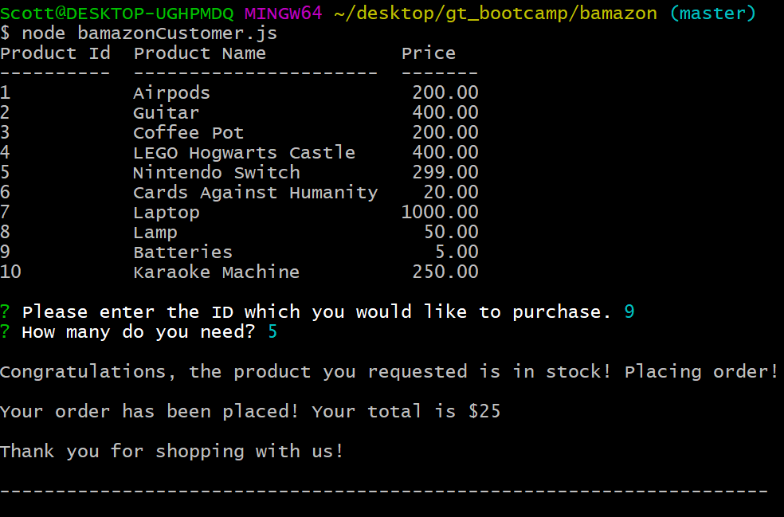
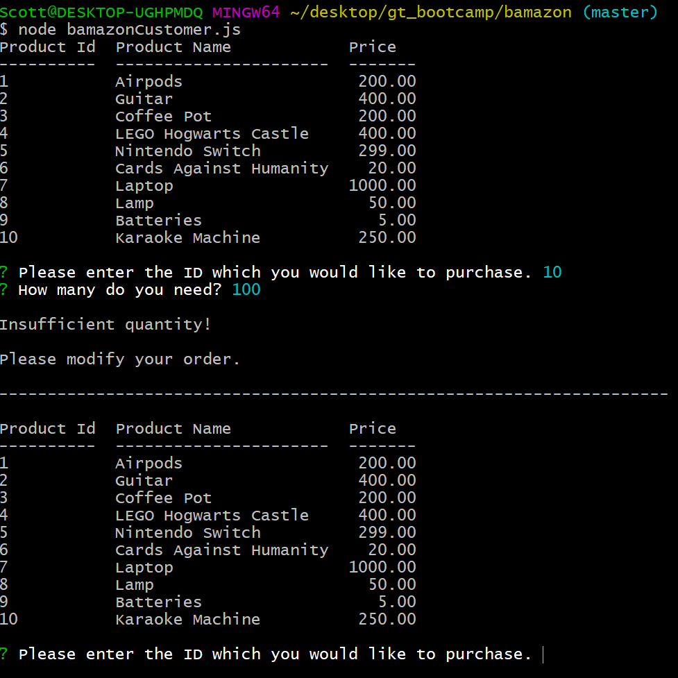

# Bamazon CLI NodeJS App

**Creator**: `Scott Ladd`

**Created on**: `Nov 13th 2019`

- - -

## ABOUT THE APP
Bamazon is a Amazon-like storefront that connects to the MySQL Workbench program to read and modify a database. The app will take in orders from customers and deplete stock from the store's inventory.

- - -

## HOW TO USE THE CLI
### **Step by Step instructions**

1. Clone the repository
2. Navigate to the folder that contains the `bamazonCustomer.js` file.
3. Run npm install, and the following packages should be installed:
   * [MySQL](https://www.npmjs.com/package/mysql)
   * [Easy-Table](https://www.npmjs.com/package/easy-table)
   * [Inquirer](https://www.npmjs.com/package/inquirer)
4. In order to run this application, you need to have the MySQL Workbench, or something similar like Sequel Pro mentioned below, already set up on your machine. If you don't, visit the [MySQL installation page](https://dev.mysql.com/downloads/workbench/) to install the version you need for your operating system. Once you have MySQL installed, you will be able to create the *Bamazon* database and the *products* table with the SQL code found in [Bamazon.sql](Bamazon.sql) file. Run this code inside your MySQL client like [Sequel Pro](https://www.sequelpro.com/) to populate the database, then you will be ready to proceed with running the Bamazon customer interface. 
5. To get started all you have to do in your terminal is run the command `node bamazonCustomer.js`.

    **Example 1**: This example shows there is enough inventory to complete the order and the purchase is successful. 

    See screen-shot below:

    

    **Example 2**: This example shows that there is not enough inventory to complete the order and the user should modify their order.
    
    See screen-shot below:

    

- - -

## TECHNOLOGIES USED
* Javascript
* Nodejs
* Node packages:
    * MySQL
    * Easy-Table
    * Inquirer
* MySQL
* Docker
* Git
* GitHub